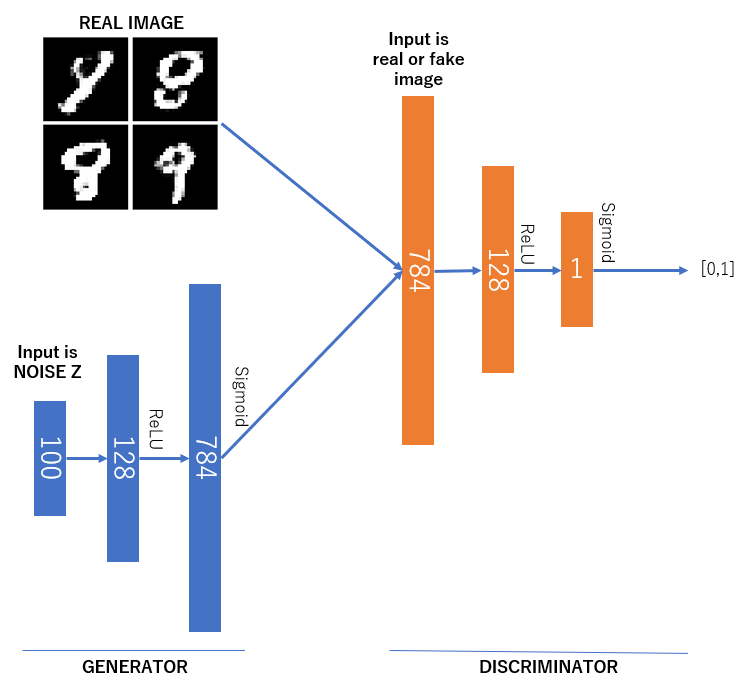
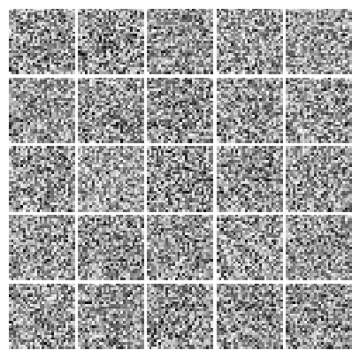

# Vanilla GAN in Tensorflow
This is a very simple step by step implementation of vanilla GAN using Tensorflow.  

### What you can find
* Vanilla GAN
* Xavier Initialization
* Adam optimizer

### Requirements  
* Tensorflow  
* Matplotlib (to visualize/save results)  

## Network  

## Results

## Author  
Noi Q. Truong / [@noitq](http://developerkeep.com)
